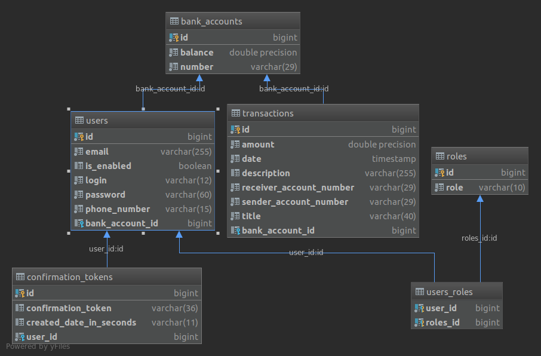

# Bank Account Web Application

This project is a bank account web application. I used MVC and Facade patterns.

### Stack

<b>Back-end</b>
* Java 8
* Maven
* Spring Boot
* Spring Data
* Spring Validation
* Spring Security
* JPA
* Hibernate
* PostgreSQL
* Lombok
* Guava: Google Libraries for Java
* SMTP protocol
* SLF4J

<b>Front-end</b>
* Thymeleaf
* Thymeleaf Extras Springsecurity5
* Bootstrap 4
* SweetAlert

<b>Tests</b>
* Kotlin
* JUnit 5 Jupiter

<b>Code editor</b>
* Intellij
* Visual Studio Code

### Prerequisites

Application requires running PostgreSQL database with:
* schema name: project
* username: postgres
* password: admin

### Build with Maven and run Java application

```sh
$ mvn clean install
```
```sh
$ java -jar target/project-0.0.1-SNAPSHOT.jar
```

### Tests
Run all tests with <i>FeatureTestSuite.kt</i> class in <i>src/test/kotlin/pl.robert.project</i>

### About project

* login and password for admin accounts are a:a and b:b
* application uses 2 roles, user and admin
* anonymous user can create new account
* when creating new account, server will send a verification token to given email
* when user forgot password or login, he can reset it by giving correct email and server will send a verification token to given email
* each user after success registration, get random generated bank account number
* application has 2 panels, user panel and admin panel
* in user panel you can change details about your account, send transaction to other users and see list of received/sent transactions
* in admin panel you can make CRUD operations on users

### Database structure

