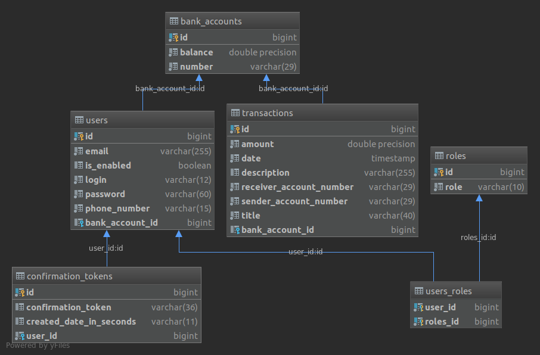

# Bank Account Web Application

This project is a bank account web application. I used MVC and Facade patterns.

### Stack

<b>Back-end</b>
* Java 8
* Maven
* Spring Boot
* Spring Data
* Spring Validation
* Spring Security
* JPA
* Hibernate
* PostgreSQL
* Lombok
* Guava: Google Libraries for Java
* SMTP protocol
* SLF4J

<b>Front-end</b>
* Thymeleaf
* Thymeleaf Extras Springsecurity5
* Bootstrap 4
* SweetAlert

<b>Tests</b>
* Kotlin
* JUnit 5 Jupiter

<b>Code editor</b>
* Intellij
* Visual Studio Code

### Prerequisites

Application requires running PostgreSQL database with:
* schema name: project
* username: postgres
* password: admin

### Build with Maven and run Java application

```sh
$ mvn clean install
```
```sh
$ java -jar target/project-0.0.1-SNAPSHOT.jar
```

### Running the tests
Run all tests with <i>FeatureTestSuite.kt</i> class in <i>src/test/kotlin/pl.robert.project</i>

### Features

-[x] login and password for admin accounts are a:a and b:b
-[x] ability to switch language to english, polish or german at homepage
-[x] application uses user and admin role, that means there is a separate panel for each of these roles
-[x] anonymous user can create or recover his account
-[x] after create or recover account, server will automatically send a confirmation token to given email
-[x] after success registration, each user get random number of his bank account
-[x] application has user and admin panel
-[x] at user panel there is ability to change details about your account, send transaction to other users and see list of received/sent transactions
-[x] at admin panel there is ability to make CRUD operations on users accounts

### Database structure

